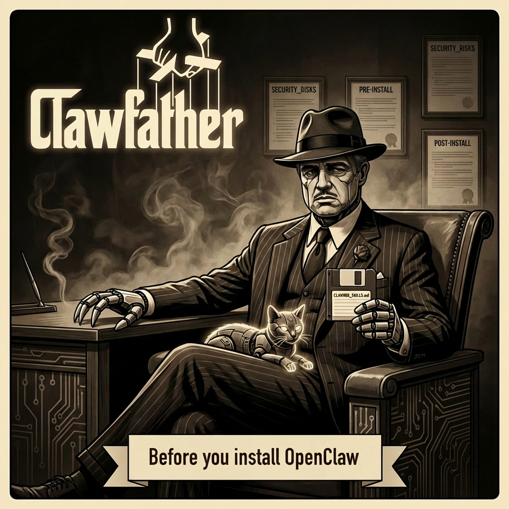
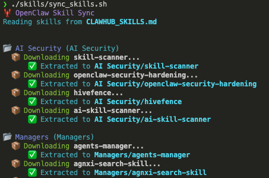

# 🦞 Clawfather Resources




---

## About

Clawfather repo is a pre-install checklist  **before** you install OpenClaw.

You can also sync skills using `./sync_skills.sh` that I hand picked from clawhub.ai 
**LAST UPDATE:** Feb 3, 2026.



Please go through steps 1..8 before installing OpenClaw.

Why? So that you don't fuck up. From there, you are on your own my friend.

*Please don't create Skynets or Molt churches. Use Asimov's laws as a guide. And always be careful with API keys!*

## STEPS

**STEP 1: Customize Skills**
Review [CLAWHUB_SKILLS.md](CLAWHUB_SKILLS.md) and remove any skills you don't need.

**STEP 2: Sync Skills**
Run `./skills/sync_skills.sh` to download and extract the latest skills.
*(This parses CLAWHUB_SKILLS.md and populates the skills/ directory)*

**STEP 3: Understand Risks**
Read [OPENCLAW_SECURITY_RISKS.md](OPENCLAW_SECURITY_RISKS.md).

**STEP 4: Preparation**
Follow [OPENCLAW_SECURITY_PRE_INSTALL.md](OPENCLAW_SECURITY_PRE_INSTALL.md) to secure your environment.

**STEP 5: Post-Install Security**
Follow [OPENCLAW_SECURITY_POST_INSTALL.md](OPENCLAW_SECURITY_POST_INSTALL.md) after setup.

**STEP 6: Cost Analysis**
Check [OPENCLAW_COST_ESTIMATIONS.md](OPENCLAW_COST_ESTIMATIONS.md).

**STEP 7: Deployment**
Decide between Docker or Local: [OPENCLAW_DOCKER_VS_LOCAL.md](OPENCLAW_DOCKER_VS_LOCAL.md).

**STEP 8: Read Core Documentation**
Check [OPENCLAW_README.md](OPENCLAW_README.md) for the architecture deep dive, macOS apps, and official resources.

**BONUS: Explore Clawfather**
See what's possible and how to earn: [OPENCLAW_USE_CASES_AND_MONETIZATION.md](OPENCLAW_USE_CASES_AND_MONETIZATION.md).

And now you can start installation of AI hell!

### Included Skills
```text
skills/
├── AI Security
│   ├── skill-scanner: Malware scanner for skills
│   ├── openclaw-security-hardening: Protect from prompt injection
│   ├── hivefence: Collective immunity network
│   └── ai-skill-scanner: Audit & scan skills
├── Managers
│   ├── agents-manager: Profile & route tasks
│   ├── agnxi-search-skill: Search AI tools directory
│   ├── clawhub: Install skills from chat
│   ├── clawdbot-skill-update: Backup & update workflow
│   ├── update-plus: Config & skill backups
│   ├── auto-updater: Daily auto-updates
│   ├── skills-search: Search skill registry
│   ├── skillcraft: Create & package skills
│   ├── skillvet: Security scanner
│   └── task-monitor: Web dashboard
├── Web Browsing
│   ├── browser-use: Cloud browser with profiles
│   └── browser-use-api: Cloud automation API
├── MCP
│   └── openclaw-mcp-plugin: Model Context Protocol
├── macOS
│   ├── peekaboo: Capture UI & automate
│   ├── homebrew: Manage packages & casks
│   ├── apple-mail: Read & send emails
│   ├── apple-mail-search-safe: Fast safe search
│   ├── accli (Calendar): Manage calendar events
│   ├── apple-reminders: Manage todo lists
│   ├── apple-photos: Search & view photos
│   ├── apple-music: Control playback & playlists
│   └── mac-tts: Text-to-speech
├── Smart Home
│   └── moltbot-ha: Control Home Assistant
├── Crawlers / Searchers
│   ├── perplexity: AI answers with citations
│   ├── exa-web-search-free: AI web & code search
│   ├── google-search: Custom Search Engine
│   ├── reddit-readonly: Read-only Reddit browsing
│   ├── firecrawler: Scrape & extract data
│   ├── twitter-6ql: Monitor X trends & tweets
│   ├── job-search-mcp-jobspy: Job aggregator
│   └── topic-monitor: Monitor topics & alerts
├── News
│   ├── clawnews: Aggregator & reader
│   ├── finance-news: Market briefings
│   ├── market-news-analyst: Impact analysis
│   ├── hn-digest: Hacker News digestion
│   ├── news-aggregator-skill: Multi-source aggregation
│   ├── hn: Browse Hacker News
│   └── news-summary: Daily briefings
├── YouTube
│   ├── yt-dlp-downloader-skill: Download videos
│   ├── youtube: Search & details
│   ├── youtube-summarizer: Transcripts & summaries
│   ├── youtube-data: Metadata & channel info
│   ├── youtube-search: Search videos & channels
│   └── yt-video-downloader: Download formats
├── Crypto
│   ├── skillzmarket: Monetized AI skills
│   ├── crypto-price: Token prices & charts
│   └── stock-analysis: Analyze assets
├── Polymarket
│   ├── polymarket: Check odds & markets
│   ├── polymarket-odds: Sports & politics odds
│   ├── polymarket-agent: Auto-trading agent
│   ├── polymarket-trading-bot: Trading bot for prediction markets.
│   ├── pm-odds: Query markets
│   ├── polymarket-api: API queries
│   ├── polymarket-analysis: Arbitrage & sentiment
│   ├── polymarket-all-in-one: All-in-one tool
│   ├── better-polymarket: Improved market tool
│   ├── polymarket-7ceau: Trade & analyze
│   ├── unifai-trading-suite: Prediction markets suite
│   ├── polymarket-trading: Trading operations
│   ├── reef-polymarket-arb: Arbitrage discovery
│   ├── alpha-finder: Market intelligence oracle
│   ├── polyclaw: Autonomous trader agent
│   ├── simmer: Trading arena
│   ├── clawstake: Agent prediction markets
│   ├── reef-polymarket-research: Research & direction
│   ├── simmer-copytrading: Mirror top traders
│   ├── test: Portfolio tracking
│   ├── onchain-test: Onchain portfolio
│   ├── simmer-weather: Weather markets
│   ├── simmer-signalsniper: Signal based trading
│   ├── prediction-markets-roarin: Roarin network betting
│   └── reef-paper-trader: Paper trading system
├── Coding
│   ├── roast-gen: Humorous code review
│   ├── code-roaster: Brutal code review
│   └── coding-agent-3nd: Coding & refactoring
├── Source Control
│   ├── github: Issues, PRs, runs
│   ├── glab-cli: GitLab CLI
│   ├── github-kb: Local KB & search
│   ├── gitclaw: Agent workspace backup
│   ├── openclaw-backup-optimized: Optimized backups
│   ├── gitlab-cli-skills: GitLab CLI wrapper
│   ├── git-sync: Sync local to remote
│   ├── github-pr: PR tool
│   ├── ai-ci: Generate CI pipelines
│   ├── github-mentions: Track mentions
│   ├── gitflow: Monitor CI status
│   └── gitlab-manager: API manager
├── Server Monitoring & Security
│   ├── linux-service-triage: Diagnose issues
│   └── security-system-zf: Security ops
├── Memory & Persistence
│   ├── openclaw-persistent-memory: Auto-context capture
│   └── penfield: Knowledge graphs
├── Productivity
│   ├── procrastination-buster: Task breakdown
│   ├── adhd-assistant: Life management
│   ├── proactive-agent: Anticipate needs
│   ├── todo: Task management
│   └── personas: AI personalities
├── Assistants
│   └── founder-coach: Startup mindset
└── Office
    ├── openclaw-nextcloud: Notes, Tasks, Files
    └── caldav-calendar: Sync calendars
```

## TODO
- auto security check skills
- website for this